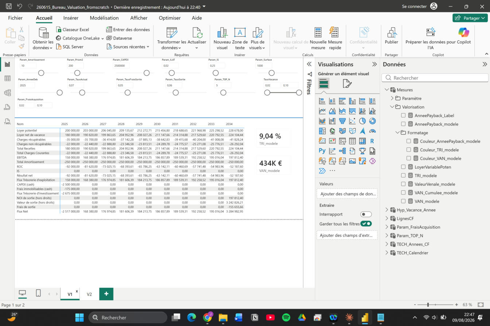

Office Valuation Engine
Objectif

Moteur de valorisation DCF (discounted cash-flow) pour actifs de bureaux : modélise le cash-flow d'exploitation, la vacance, la fiscalité et la valeur de sortie hors droits d'un actif, avec des hypothèses pilotables en direct plutôt que ressaisies dans un tableur à chaque scénario.

Fonctionnement
Loyer brut indexé sur l'ILAT, net d'un taux de vacance paramétrable année par année
Charges d'exploitation scindées récupérables / non récupérables (seules les non récupérables pèsent sur le NOI)
NOI, résultat imposable après amortissement, IS, flux net d'exploitation
Valeur de sortie hors droits par la méthode du rendement (NOI de sortie / taux de sortie), nette des frais de sortie
VAN actualisée au taux choisi ; TRI calculé par XIRR (base actual/365)
Valeur vénale = VAN / (1 + frais d'acquisition)
Sliders interactifs sur chaque hypothèse (ILAT, taux d'actualisation, vacance, frais...), VAN cumulée et année de retournement affichées en direct, code couleur dynamique recalculé selon le scénario (pas de seuil figé)
Stack technique

Power BI / DAX (mesures calculées, tables de paramètres GENERATESERIES, XIRR).

Limite connue

Jeu de données de démonstration entièrement fictif — le modèle ne remplace pas une due diligence complète (fiscalité, garanties de passif, état locatif détaillé, etc.).

Aperçu

4 indicateurs clés (VAN, TRI, année de retournement, valeur vénale), avec code couleur dynamique — recalculé automatiquement selon les hypothèses sélectionnées, pas figé sur un seuil. Sliders regroupés par thème et trajectoire de VAN cumulée pour visualiser le point de retournement de l'investissement.

Matrice ligne par ligne, année par année : loyer brut → vacance → loyer net → charges (récupérables / non récupérables) → EBITDA → amortissement → IS → flux net, jusqu'à la valeur de sortie hors droits.
